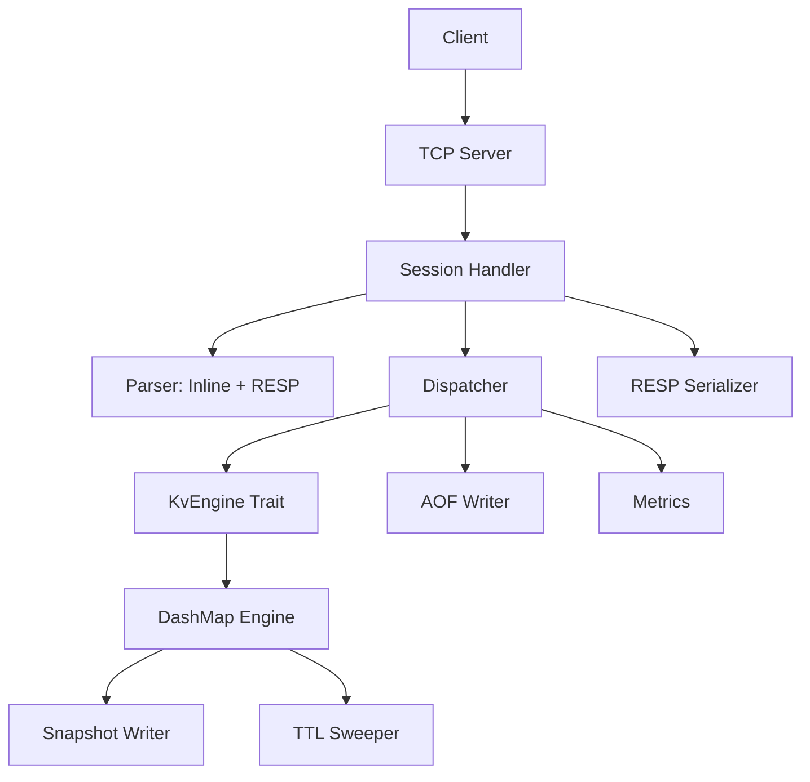

# ZetDB

Banco de dados in-memory estilo Redis, implementado em Rust com foco em **alta concorrência**, **baixa latência** e **segurança de memória**.

## Performance

| Benchmark | ZetDB (WSL) | Redis (WSL) | ZetDB (Windows) |
|---|---|---|---|
| SET peak | **7.63M ops/s** | 1.16M ops/s | 688K ops/s |
| GET peak | **12.16M ops/s** | 2.74M ops/s | 708K ops/s |

> Benchmark: pipeline mode, 5s/test, RESP protocol. Veja [report.html](docs/benchmarks/report.html) para gráficos completos.

## Visão Geral

ZetDB é um KV store TCP concorrente com protocolo dual (inline + RESP), persistência (Snapshot + AOF), TTL e observabilidade.

### Features

- Servidor TCP assíncrono (Tokio) com pipelining
- **Protocolo dual**: inline text + RESP (Redis-compatible)
- Comandos: `PING`, `SET`, `GET`, `DEL`, `INCR`, `INFO`, `DBSIZE`
- Storage concorrente com DashMap (sharding por chave)
- TTL com lazy eviction + sweeper ativo
- **Persistência**: Snapshot binário (ZDB1) + AOF com fsync configurável
- **Observabilidade**: Contadores lock-free (toggle via config)
- Zero-allocation parsing e serialization no hot path

### Stack

| Componente | Tecnologia |
|---|---|
| Linguagem | Rust (estável, edition 2021) |
| Runtime assíncrono | Tokio |
| Buffers | `bytes::Bytes` / `BytesMut` |
| Storage concorrente | DashMap |
| Protocolo | Inline text + RESP |
| Persistência | Snapshot (binary) + AOF |
| Integer formatting | `itoa` (zero-alloc) |
| CRC32 | `crc32fast` |

## Arquitetura

Arquitetura modular com separação em camadas — protocolo, aplicação, domínio e storage são independentes de transporte.



### Módulos

```text
src/
  main.rs              # Entry point + orchestration
  config/              # Configuração (bind, timeout, snapshot, AOF, metrics)
  server/              # TCP accept loop, session handler
  protocol/            # Parser (inline + RESP), response serializer
  application/         # Command dispatcher
  domain/              # Command enum, ValueEntry, error types
  storage/             # KvEngine trait, DashMap impl, snapshot, AOF
  observability/       # Lock-free atomic counters
```

## Documentação

| Documento | Descrição |
|---|---|
| [docs/ARCHITECTURE.md](docs/ARCHITECTURE.md) | **Arquitetura técnica com diagramas Mermaid** |
| [docs/benchmarks/report.html](docs/benchmarks/report.html) | **Benchmark comparativo: ZetDB vs Redis** |
| [architecture.md](architecture.md) | Decisões arquiteturais e contratos |
| [docs/SPECIFICATION.md](docs/SPECIFICATION.md) | Especificação formal de tipos e interfaces |
| [docs/SNAPSHOT.md](docs/SNAPSHOT.md) | Design do snapshot persistence |
| [docs/AOF.md](docs/AOF.md) | Design do Append-Only File |
| [docs/OBSERVABILITY.md](docs/OBSERVABILITY.md) | Design da observabilidade |
| [docs/PHASES.md](docs/PHASES.md) | Planejamento por fases |

## Quick Start

```bash
# Build
cargo build --release

# Run
./target/release/zetdb

# Testar (inline protocol)
echo "PING" | nc localhost 6379
echo "SET mykey hello" | nc localhost 6379
echo "GET mykey" | nc localhost 6379

# Testar (RESP protocol via redis-cli)
redis-cli -p 6379 PING
redis-cli -p 6379 SET mykey hello
redis-cli -p 6379 GET mykey
```

## Benchmark

```bash
# Benchmark completo (pipeline throughput)
cargo run --release --bin pipeline

# Comparação com Redis
cargo run --release --bin redis_compare -- --target zetdb --port 6379 --format text
cargo run --release --bin redis_compare -- --target redis --port 6380 --format json
```

## Desenvolvimento

Este projeto segue **SDD (Specification-Driven Development)** — toda implementação é precedida por especificação, validação arquitetural e critérios de aceite claros.

## Licença

Veja [LICENSE](LICENSE).
