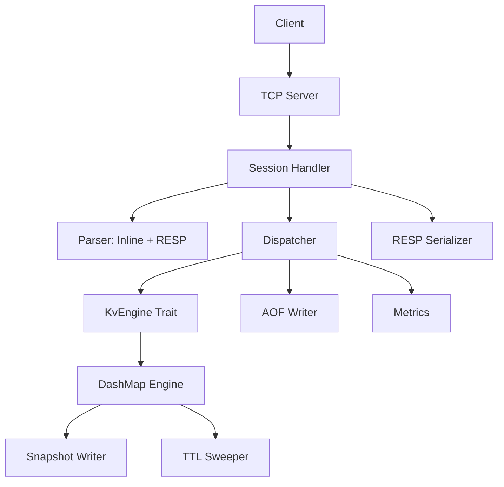

# ZetDB

Banco de dados in-memory estilo Redis, implementado em Rust com foco em **alta concorrência**, **baixa latência** e **segurança de memória**.

## Performance

| Benchmark | ZetDB (WSL) | Redis (WSL) | ZetDB (Windows) |
|---|---|---|---|
| SET peak | **7.63M ops/s** | 1.16M ops/s | 688K ops/s |
| GET peak | **12.16M ops/s** | 2.74M ops/s | 708K ops/s |

> Benchmark: pipeline mode, 5s/test, RESP protocol. Veja [report.html](docs/benchmarks/report.html) para gráficos completos.

## Visão Geral

ZetDB é um KV store TCP concorrente com protocolo dual (inline + RESP), persistência (Snapshot + AOF), TTL e observabilidade.

### Features

- Servidor TCP assíncrono (Tokio) com pipelining
- **Protocolo dual**: inline text + RESP (Redis-compatible)
- Comandos: `PING`, `SET`, `GET`, `DEL`, `INCR`, `INFO`, `DBSIZE`, `EXISTS`, `TTL`, `EXPIRE`, `FLUSHDB`, `KEYS`, `MGET`, `MSET`
- Storage concorrente com DashMap (sharding por chave)
- TTL com lazy eviction + sweeper ativo
- **Persistência**: Snapshot binário (ZDB1) + AOF com fsync configurável
- **Observabilidade**: Contadores lock-free (toggle via config)
- Zero-allocation parsing e serialization no hot path

### Stack

| Componente | Tecnologia |
|---|---|
| Linguagem | Rust (estável, edition 2021) |
| Runtime assíncrono | Tokio |
| Buffers | `bytes::Bytes` / `BytesMut` |
| Storage concorrente | DashMap |
| Protocolo | Inline text + RESP |
| Persistência | Snapshot (binary) + AOF |
| Integer formatting | `itoa` (zero-alloc) |
| CRC32 | `crc32fast` |

## Arquitetura

Arquitetura modular com separação em camadas — protocolo, aplicação, domínio e storage são independentes de transporte.



### Módulos

```text
src/
  main.rs              # Entry point + orchestration
  config/              # Configuração (bind, timeout, snapshot, AOF, metrics)
  server/              # TCP accept loop, session handler
  protocol/            # Parser (inline + RESP), response serializer
  application/         # Command dispatcher
  domain/              # Command enum, ValueEntry, error types
  storage/             # KvEngine trait, DashMap impl, snapshot, AOF
  observability/       # Lock-free atomic counters
```

## Documentação

| Documento | Descrição |
|---|---|
| [docs/ARCHITECTURE.md](docs/ARCHITECTURE.md) | **Arquitetura técnica com diagramas Mermaid** |
| [docs/benchmarks/report.html](docs/benchmarks/report.html) | **Benchmark comparativo: ZetDB vs Redis** |
| [architecture.md](architecture.md) | Decisões arquiteturais e contratos |
| [docs/SPECIFICATION.md](docs/SPECIFICATION.md) | Especificação formal de tipos e interfaces |
| [docs/SNAPSHOT.md](docs/SNAPSHOT.md) | Design do snapshot persistence |
| [docs/AOF.md](docs/AOF.md) | Design do Append-Only File |
| [docs/OBSERVABILITY.md](docs/OBSERVABILITY.md) | Design da observabilidade |
| [docs/PHASES.md](docs/PHASES.md) | Planejamento por fases |

## Comandos

| Comando | Inline | RESP | Descrição |
|---|---|---|---|
| `PING` | `PING` | `*1\r\n$4\r\nPING` | Health check |
| `SET key value` | `SET mykey hello` | `*3\r\n$3\r\nSET\r\n...` | Armazena um par chave-valor |
| `SET key value EX secs` | `SET k v EX 60` | com TTL | SET com expiração em segundos |
| `GET key` | `GET mykey` | `*2\r\n$3\r\nGET\r\n...` | Recupera valor |
| `DEL key` | `DEL mykey` | `*2\r\n$3\r\nDEL\r\n...` | Remove chave |
| `INCR key` | `INCR counter` | `*2\r\n$4\r\nINCR\r\n...` | Incremento atômico (init 1) |
| `EXISTS key` | `EXISTS mykey` | `*2\r\n$6\r\nEXISTS\r\n...` | Verifica existência |
| `TTL key` | `TTL mykey` | `*2\r\n$3\r\nTTL\r\n...` | TTL restante (-1=inf, -2=ausente) |
| `EXPIRE key secs` | `EXPIRE mykey 30` | `*3\r\n$6\r\nEXPIRE\r\n...` | Define expiração |
| `DBSIZE` | `DBSIZE` | `*1\r\n$6\r\nDBSIZE` | Total de chaves |
| `KEYS` | `KEYS` | `*1\r\n$4\r\nKEYS` | Lista todas as chaves |
| `FLUSHDB` | `FLUSHDB` | `*1\r\n$7\r\nFLUSHDB` | Remove todas as chaves |
| `MGET k1 k2 ...` | `MGET a b c` | `*4\r\n$4\r\nMGET\r\n...` | Multi-get |
| `MSET k1 v1 k2 v2` | `MSET a 1 b 2` | `*5\r\n$4\r\nMSET\r\n...` | Multi-set |
| `INFO` | `INFO` | `*1\r\n$4\r\nINFO` | Info do servidor |

## Configuração

| Flag / Env | Padrão | Descrição |
|---|---|---|
| `--bind` / `ZETDB_BIND` | `0.0.0.0:6379` | Endereço de bind |
| `--timeout-secs` / `ZETDB_TIMEOUT_SECS` | `300` | Idle connection timeout |
| `--snapshot-path` / `ZETDB_SNAPSHOT_PATH` | `zetdb.zdb` | Caminho do snapshot |
| `--snapshot-secs` / `ZETDB_SNAPSHOT_SECS` | `300` | Intervalo entre snapshots |
| `--aof-path` / `ZETDB_AOF_PATH` | — | Ativa AOF no caminho especificado |
| `--aof-fsync` / `ZETDB_AOF_FSYNC` | `everysec` | Política: `always`, `everysec`, `no` |
| `--aof-rewrite-threshold` / `ZETDB_AOF_REWRITE_THRESHOLD` | `67108864` (64MB) | Threshold para rewrite |
| `--metrics` / `ZETDB_METRICS` | `true` | Ativa contadores de métricas |

## Quick Start

```bash
# Build
cargo build --release

# Run com padrões
./target/release/zetdb

# Run com AOF e snapshot a cada 60s
./target/release/zetdb --aof-path data/zetdb.aof --snapshot-secs 60

# Testar (inline protocol)
echo "PING" | nc localhost 6379
echo "SET mykey hello" | nc localhost 6379
echo "GET mykey" | nc localhost 6379

# Testar (RESP protocol via redis-cli)
redis-cli -p 6379 PING
redis-cli -p 6379 SET mykey hello
redis-cli -p 6379 GET mykey
redis-cli -p 6379 MSET a 1 b 2 c 3
redis-cli -p 6379 MGET a b c
```

## Docker

```bash
# Build
docker build -t zetdb .

# Run
docker run -d -p 6379:6379 -v zetdb-data:/data zetdb

# Run com AOF
docker run -d -p 6379:6379 -v zetdb-data:/data zetdb \
  --aof-path /data/zetdb.aof
```

## Benchmark

```bash
# Benchmark completo (pipeline throughput)
cargo run --release --bin pipeline

# Comparação com Redis
cargo run --release --bin redis_compare -- --target zetdb --port 6379 --format text
cargo run --release --bin redis_compare -- --target redis --port 6380 --format json
```

## Licença

Veja [LICENSE](LICENSE).
