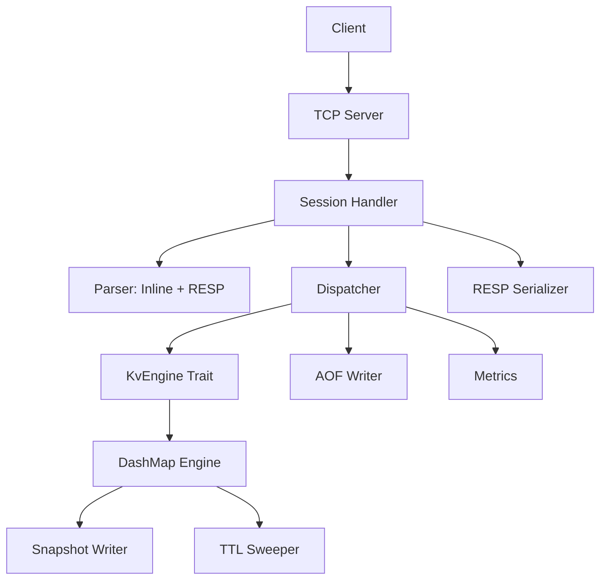

# ZetDB

Banco de dados in-memory estilo Redis, implementado em Rust com foco em **alta concorrência**, **baixa latência** e **segurança de memória**.

## Performance

| Benchmark | ZetDB (WSL) | Redis (WSL) | ZetDB (Windows) |
|---|---|---|---|
| SET peak | **7.63M ops/s** | 1.16M ops/s | 688K ops/s |
| GET peak | **12.16M ops/s** | 2.74M ops/s | 708K ops/s |

> Benchmark: pipeline mode, 5s/test, RESP protocol. Veja [report.html](docs/benchmarks/report.html) para graficos completos.

## Visao Geral

ZetDB e um KV store TCP concorrente com protocolo dual (inline + RESP), persistencia (Snapshot + AOF), TTL e observabilidade.

### Features

- Servidor TCP assincrono (Tokio) com pipelining
- **Protocolo dual**: inline text + RESP (Redis-compatible)
- Comandos: `PING`, `SET`, `GET`, `DEL`, `INCR`, `INFO`, `DBSIZE`, `EXISTS`, `TTL`, `EXPIRE`, `FLUSHDB`, `KEYS`, `MGET`, `MSET`
- Storage concorrente com DashMap (sharding por chave)
- TTL com lazy eviction + sweeper ativo
- **Persistencia**: Snapshot binario (ZDB1) + AOF com fsync configuravel
- **Observabilidade**: Contadores lock-free (toggle via config)
- Zero-allocation parsing e serialization no hot path

### Stack

| Componente | Tecnologia |
|---|---|
| Linguagem | Rust (estavel, edition 2021) |
| Runtime assincrono | Tokio |
| Buffers | `bytes::Bytes` / `BytesMut` |
| Storage concorrente | DashMap |
| Protocolo | Inline text + RESP |
| Persistencia | Snapshot (binary) + AOF |
| Integer formatting | `itoa` (zero-alloc) |
| CRC32 | `crc32fast` |

## Arquitetura

Arquitetura modular com separacao em camadas — protocolo, aplicacao, dominio e storage sao independentes de transporte.


```mermaid
graph TB
    Client --> TCP[TCP Server]
    TCP --> Session[Session Handler]
    Session --> Parser[Parser: Inline + RESP]
    Session --> Dispatcher
    Dispatcher --> Engine[KvEngine Trait]
    Engine --> DashMap[DashMap Engine]
    Session --> Response[RESP Serializer]
    Dispatcher --> AOF[AOF Writer]
    Dispatcher --> Metrics[Metrics]
    DashMap --> Snapshot[Snapshot Writer]
    DashMap --> TTLSweeper[TTL Sweeper]
```

### Modulos

```text
src/
  main.rs              # Entry point + orchestration
  config/              # Configuracao (bind, timeout, snapshot, AOF, metrics)
  server/              # TCP accept loop, session handler
  protocol/            # Parser (inline + RESP), response serializer
  application/         # Command dispatcher
  domain/              # Command enum, ValueEntry, error types
  storage/             # KvEngine trait, DashMap impl, snapshot, AOF
  observability/       # Lock-free atomic counters
```

## Quick Start

```bash
# Build
cargo build --release

# Run com padroes
./target/release/zetdb

# Run com AOF e snapshot a cada 60s
./target/release/zetdb --aof-path data/zetdb.aof --snapshot-secs 60

# Testar (inline protocol)
echo "PING" | nc localhost 6379
echo "SET mykey hello" | nc localhost 6379
echo "GET mykey" | nc localhost 6379

# Testar (RESP protocol via redis-cli)
redis-cli -p 6379 PING
redis-cli -p 6379 SET mykey hello
redis-cli -p 6379 GET mykey
redis-cli -p 6379 MSET a 1 b 2 c 3
redis-cli -p 6379 MGET a b c
```

## Como Rodar os Testes

```bash
# Todos os testes (incluindo unitarios e de integracao)
cargo test

# Testes com output visivel
cargo test -- --nocapture

# Testes especificos de storage
cargo test storage::

# Testes de integracao TCP
cargo test server::tcp::

# Clippy (lint)
cargo clippy -- -D warnings

# Formatacao
cargo fmt -- --check
```

## Resumo Arquitetural

| Decisao | Motivacao |
|---|---|
| DashMap para storage | Sharding por chave elimina lock global; acesso concorrente O(1) |
| Protocolo dual (inline + RESP) | Inline para debugging humano; RESP para compatibilidade com clientes Redis |
| TTL lazy + sweeper | Evita overhead de timer por chave; eviction em background e no acesso |
| Snapshot binario + AOF | Snapshot para recuperacao rapida; AOF para durabilidade incremental |
| `bytes::Bytes` no hot path | Zero-copy buffers; evita alocacoes em parsing e serializacao |
| Trait `KvEngine` | Permite trocar backend sem reescrever camadas superiores |

## Trade-offs e Assumptions

1. **Max keys vs max memory**: Usamos `max_keys` como proxy para controle de memoria, nao bytes exatos. Isso e mais simples de implementar e sufficiente para a maioria dos casos, mas nao protege contra valores grandes.

2. **Eviction aproximado**: A politica `allkeys-lru` amostra ate 5 chaves e remove a mais antiga. Nao e LRU exato, mas e O(1) e efetivo o suficiente para um MVP.

3. **MSET nao-atomico**: Cada par e escrito individualmente. Falha parcial pode deixar metade das chaves definidas. Aceitavel para MVP, mas nao garante atomicidade transacional.

4. **Sem TLS/Auth**: Conexoes sao plaintext TCP. Para ambientes nao-confiaveis, requer proxy reverso (nginx, HAProxy) ou VPN.

5. **Apenas strings**: Nao suporta listas, hashes, sets, sorted sets. Escopo intencionalmente limitado a KV para manter a base de codigo enxuta.

## Configuracao

| Flag / Env | Padrao | Descricao |
|---|---|---|
| `--bind` / `ZETDB_BIND_ADDR` | `127.0.0.1` | Endereco de bind |
| `--port` / `ZETDB_PORT` | `6379` | Porta TCP |
| `--timeout-secs` / `ZETDB_READ_TIMEOUT` | `30` | Idle connection timeout (leitura) |
| `--write-timeout-secs` / `ZETDB_WRITE_TIMEOUT` | `30` | Timeout de escrita por conexao |
| `--snapshot-path` / `ZETDB_SNAPSHOT_PATH` | `dump.zdb` | Caminho do snapshot |
| `--snapshot-secs` / `ZETDB_SNAPSHOT_INTERVAL` | `60` | Intervalo entre snapshots |
| `--aof-path` / `ZETDB_AOF_PATH` | — | Ativa AOF no caminho especificado |
| `--aof-fsync` / `ZETDB_AOF_FSYNC` | `everysec` | Politica: `always`, `everysec`, `no` |
| `--aof-rewrite-threshold` / `ZETDB_AOF_REWRITE_THRESHOLD` | `64` | Threshold para rewrite (MB) |
| `--max-keys` / `ZETDB_MAX_KEYS` | `0` | Maximo de chaves (0 = ilimitado) |
| `--metrics` / `ZETDB_METRICS` | `false` | Ativa contadores de metricas |

## Estrutura do Projeto

```
.
├── Cargo.toml              # Manifesto Rust
├── Cargo.lock              # Lock de dependencias
├── Dockerfile              # Build multi-stage
├── LICENSE                 # MIT License
├── README.md               # Este arquivo
├── docs/
│   ├── ARCHITECTURE.md     # Arquitetura tecnica com diagramas
│   ├── SPECIFICATION.md    # Especificacao formal de tipos
│   ├── PHASES.md           # Planejamento por fases
│   ├── PLAN_HARDENING.md   # Plano de hardening
│   ├── SNAPSHOT.md         # Design do snapshot
│   ├── AOF.md              # Design do AOF
│   ├── OBSERVABILITY.md    # Design da observabilidade
│   └── benchmarks/
│       └── report.html     # Benchmark comparativo
├── src/
│   ├── main.rs             # Entry point
│   ├── lib.rs              # Public API
│   ├── application/        # Dispatcher de comandos
│   ├── config/             # CLI/env configuration
│   ├── domain/             # Tipos, comandos, erros
│   ├── observability/      # Metricas lock-free
│   ├── protocol/           # Parser inline + RESP
│   ├── server/             # TCP server, session handler
│   └── storage/            # Engine, snapshot, AOF, TTL
└── target/                 # Build output
```

## Docker

```bash
# Build
docker build -t zetdb .

# Run
docker run -d -p 6379:6379 -v zetdb-data:/data zetdb

# Run com AOF
docker run -d -p 6379:6379 -v zetdb-data:/data zetdb \
  --aof-path /data/zetdb.aof
```

## Benchmark

```bash
# Benchmark completo (pipeline throughput)
cargo run --release --bin pipeline

# Comparacao com Redis
cargo run --release --bin redis_compare -- --target zetdb --port 6379 --format text
cargo run --release --bin redis_compare -- --target redis --port 6380 --format json
```

## Licenca

Este projeto esta licenciado sob a [Licenca MIT](LICENSE).

Copyright (c) 2026 Matheus Zeitune
