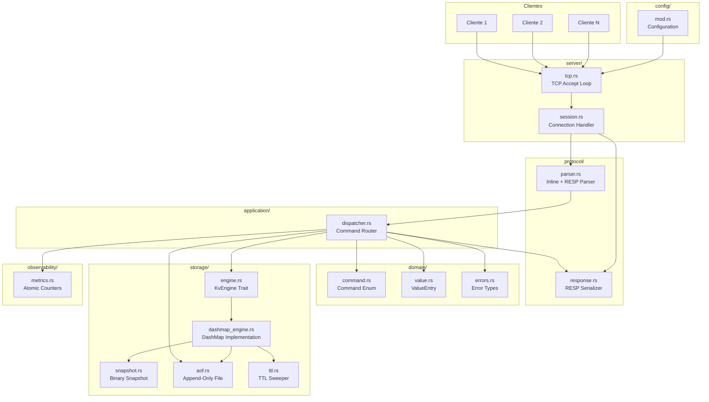
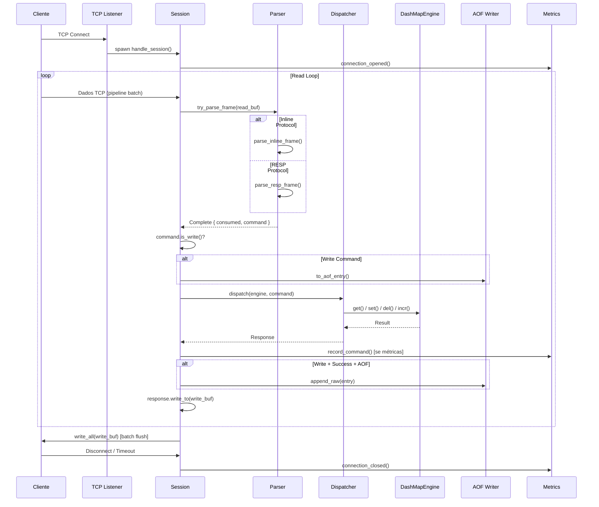
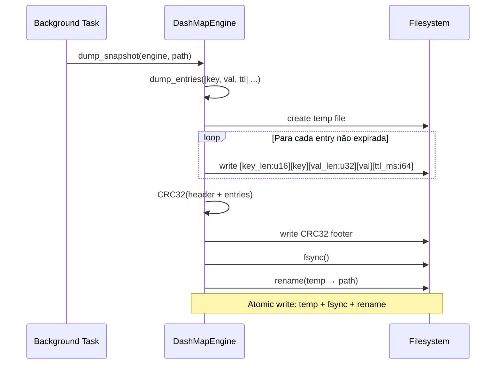
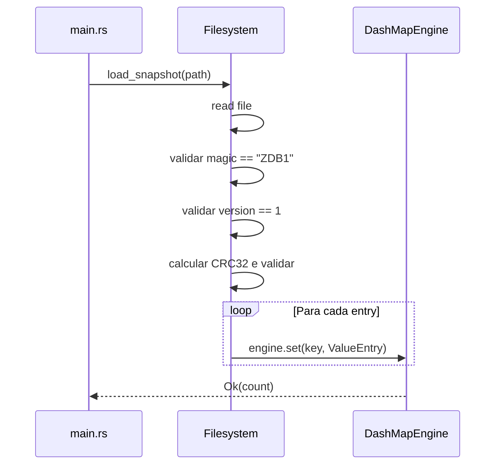
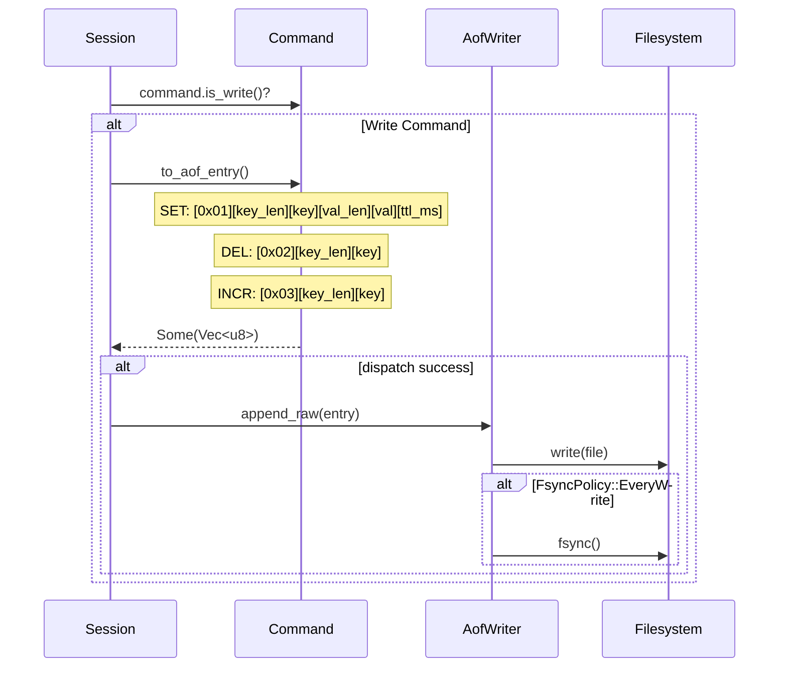
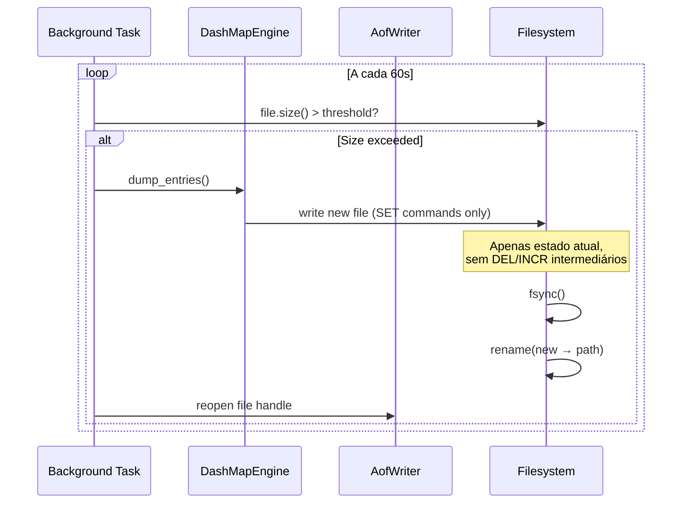
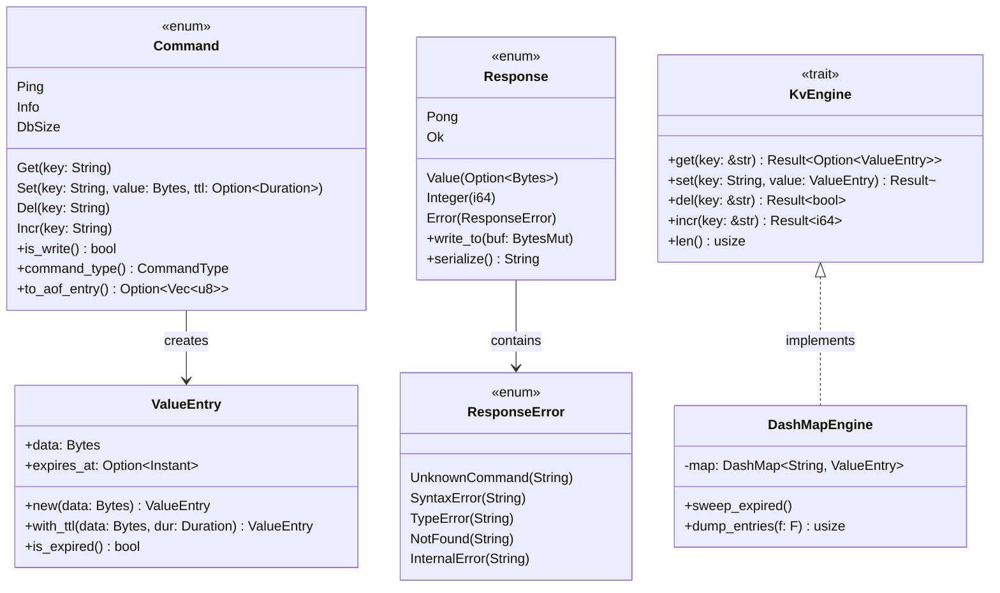
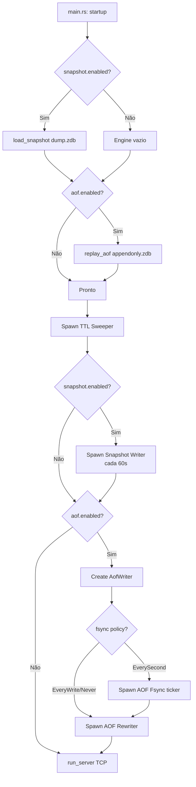
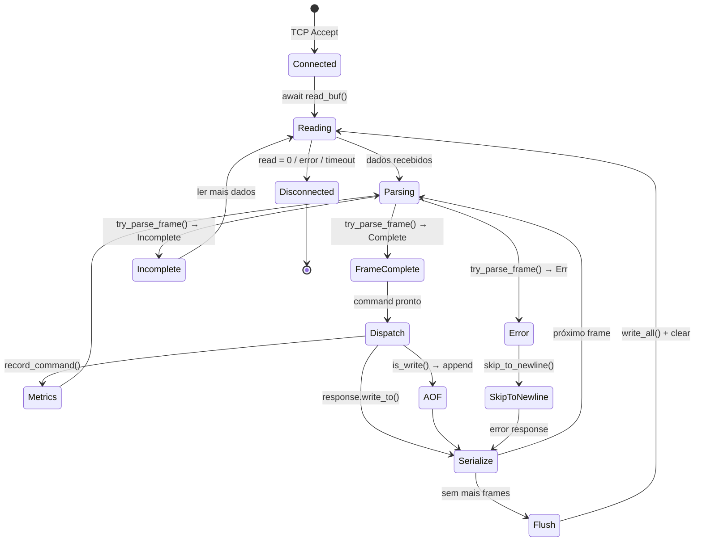
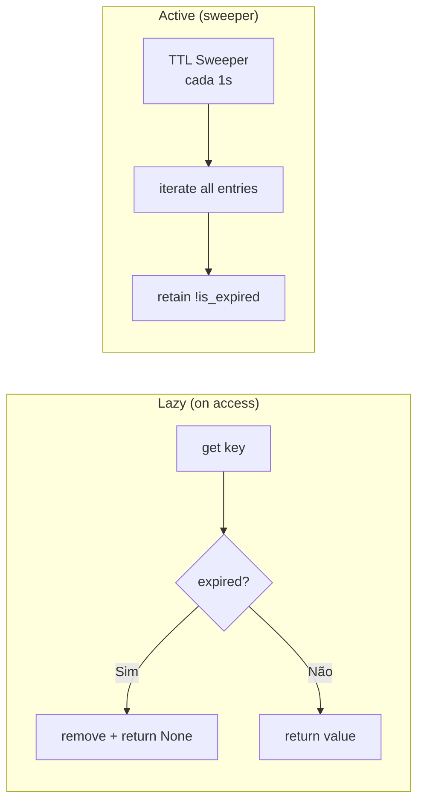

# ZetDB — Arquitetura Técnica

## Visão Geral

ZetDB é um banco de dados chave-valor em memória, inspirado no Redis, implementado em Rust. Suporta protocolos inline e RESP, persistência via Snapshot + AOF, e concorrência lock-free com DashMap.

**Stack:** Rust (stable, edition 2021) | Tokio | DashMap | bytes

---

## Diagrama de Componentes



---

## Diagrama de Sequência — Processamento de Comando



---

## Diagrama de Sequência — Snapshot (Dump)



### Formato Binário Snapshot (ZDB1)

```
┌─────────────────────────────────────────────────┐
│ Header                                          │
│  [ZDB1:4] [version:1] [flags:1] [count:u32 LE] │
│  [timestamp:u64 LE]                             │
├─────────────────────────────────────────────────┤
│ Entry × N                                       │
│  [key_len:u16 LE] [key] [val_len:u32 LE] [val]  │
│  [ttl_ms:i64 LE]  (-1 = sem TTL)                │
├─────────────────────────────────────────────────┤
│ Footer                                          │
│  [CRC32:u32 LE]                                 │
└─────────────────────────────────────────────────┘
```

---

## Diagrama de Sequência — Snapshot (Restore)



---

## Diagrama de Sequência — AOF Write



---

## Diagrama de Sequência — AOF Rewrite (Compaction)



---

## Diagrama — Modelo de Dados



---

## Diagrama — Fluxo de Persistência (Startup)



---

## Diagrama — Ciclo de Vida da Sessão



---

## Diagrama — Evicção de TTL



---

## Diagrama — Concorrência

```mermaid
flowchart TD
    subgraph "Tokio Runtime (multi-thread)"
        A1[Accept Loop]
        W1[Worker 1]
        W2[Worker 2]
        WN[Worker N]
        BG1[TTL Sweeper]
        BG2[Snapshot Writer]
        BG3[AOF Fsync/Rewriter]
    end

    subgraph "Storage Layer (lock-free)"
        DM[DashMap<br/>sharded por hash(key)]
        DM --> S1[Shard 1: RwLock]
        DM --> S2[Shard 2: RwLock]
        DM --> SN[Shard N: RwLock]
    end

    A1 --> W1 & W2 & WN
    W1 & W2 & WN --> DM

    subgraph "Metrics (lock-free)"
        AT[AtomicU64 counters<br/>Ordering::Relaxed]
    end

    W1 & W2 & WN -.-> AT
```

---

## Protocolo

### Inline (texto)

```
SET mykey hello\r\n     →  +OK\r\n
GET mykey\r\n           →  +hello\r\n
DEL mykey\r\n           →  :1\r\n
INCR counter\r\n        →  :1\r\n
PING\r\n                →  +PONG\r\n
INFO\r\n                →  +<stats text>\r\n
DBSIZE\r\n              →  :42\r\n
```

### RESP (Redis Serialization Protocol)

```
*3\r\n$3\r\nSET\r\n$5\r\nmykey\r\n$5\r\nhello\r\n  →  +OK\r\n
*2\r\n$3\r\nGET\r\n$5\r\nmykey\r\n                   →  +hello\r\n
*2\r\n$3\r\nDEL\r\n$5\r\nmykey\r\n                   →  :1\r\n
*2\r\n$4\r\nINCR\r\n$7\r\ncounter\r\n                →  :1\r\n
*1\r\n$4\r\nPING\r\n                                  →  +PONG\r\n
```

Auto-detecção: `buf[0] == '*'` → RESP, senão → inline.

---

## Otimizações de Performance

| Técnica | Local | Impacto |
|---|---|---|
| Zero-allocation parsing | parser.rs | Sem Vec intermediário, parse inline |
| Zero-allocation response | response.rs | `write_to(BytesMut)` direto |
| `itoa` para inteiros | response.rs, dashmap_engine.rs | Sem `format!` / `to_string()` |
| `from_utf8_unchecked` | parser.rs | Pula validação UTF-8 (garantido pelo protocolo) |
| Batched writes | session.rs | Flush único por read cycle |
| Metrics toggle | session.rs | `metrics_enabled: false` = zero overhead |
| DashMap sharding | dashmap_engine.rs | Lock por shard, não global |
| `entry()` API | dashmap_engine.rs | INCR atômico sem get+set |
| Atomic file write | snapshot.rs, aof.rs | temp + fsync + rename |
| `Bytes::copy_from_slice` | dashmap_engine.rs | INCR reutiliza buffer itoa |

---

## Configuração

| Parâmetro | Default | Descrição |
|---|---|---|
| `bind_addr` | 127.0.0.1 | Endereço de bind |
| `port` | 6379 | Porta TCP |
| `read_timeout` | 30s | Timeout de leitura por conexão |
| `sweep_interval` | 1s | Intervalo do TTL sweeper |
| `snapshot.enabled` | true | Persistência por snapshot |
| `snapshot.path` | dump.zdb | Arquivo de snapshot |
| `snapshot.interval` | 60s | Intervalo entre snapshots |
| `aof.enabled` | false | Append-Only File |
| `aof.path` | appendonly.zdb | Arquivo AOF |
| `aof.fsync` | EverySecond | Política de fsync |
| `aof.rewrite_threshold_mb` | 64 | Limite para compaction |
| `metrics_enabled` | false | Contadores por comando |
